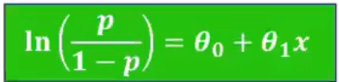
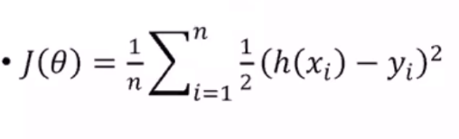
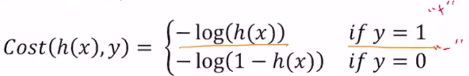
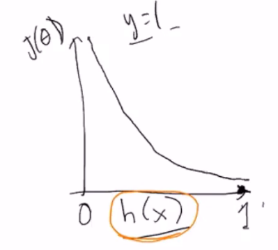
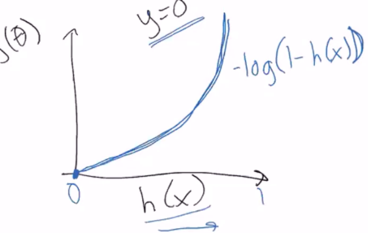
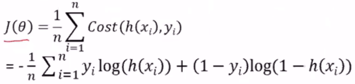

# Machine Learning Exam 3 Study Guide

## Logistic Regression

### Classification
- Discrete and supervised
- Good for when dependent variable is binary (yes/no, red/blue, etc)
- Determines probability of the binary classification (y val of sigma curve)
  

### *Loss Function
- "Cost function"

### Compare with Linear Regression
- logistic regression predicts whether something is true or false, while linear regression predicts something of continuous size
- Linear fits a straight line, while logistic fits an "S" shaped logistic curve
- Logistic curve shows likelihood of discrete classifications

---
## Multi-Layered Neural Networks

---
## Deep Networks - Large Neural Networks

---
## Convolutional Neural Networks

---
## Ensemble Classifiers

---
## K Means++

### cluster initiation
### furthest first
### probabilistic selection of cluster means
---
## Dimensionality Reduction

### Principal component analysis, Principal components
### Minimize data distance to line
### maximize distance of projected points to origin
### selecting components
### *Visualization of first component, additional components

---
## Overall: highlights of algorithms, *compare and contrast

### NBC

### linear regression
### logistic regression
### decision tree
### knn
### random forest
### neural network
### k means
### boosting
### svm