# Machine Learning Exam 3 Study Guide

- [Machine Learning Exam 3 Study Guide](#machine-learning-exam-3-study-guide)
  - [Logistic Regression](#logistic-regression)
    - [Classification](#classification)
    - [*Loss Function](#loss-function)
    - [Compare with Linear Regression](#compare-with-linear-regression)
  - [Multi-Layered Neural Networks](#multi-layered-neural-networks)
    - [Loss functions](#loss-functions)
    - [Tanh Activation Function and Motivation](#tanh-activation-function-and-motivation)
    - [* Forward Propagation to compute output](#ul-liforward-propagation-to-compute-outputli-ul)
      - [Steps w/ Example:](#steps-w-example)
    - [Backward Propagation to Compute Weights](#backward-propagation-to-compute-weights)
      - [Steps w/ Example](#steps-w-example-1)
    - [Inductive Bias](#inductive-bias)
    - [* Hyperparameters and Impact on Underfitting/Overfitting](#ul-lihyperparameters-and-impact-on-underfittingoverfittingli-ul)
  - [Deep Networks - Large Neural Networks](#deep-networks---large-neural-networks)
  - [Convolutional Neural Networks](#convolutional-neural-networks)
    - [Convolution](#convolution)
    - [Pooling](#pooling)
  - [Support Vector Machines (SVM)](#support-vector-machines-svm)
    - [Constrained Optinizations](#constrained-optinizations)
    - [*Hard Margin](#hard-margin)
    - [*Soft Margin](#soft-margin)
    - [*Role of Hyperparameter in Overfitting and Underfitting](#role-of-hyperparameter-in-overfitting-and-underfitting)
    - [Slack Parameters](#slack-parameters)
    - [Size of the Margin](#size-of-the-margin)
    - [Kernels](#kernels)
  - [Ensemble Classifiers](#ensemble-classifiers)
    - [Voting](#voting)
    - [Resampling](#resampling)
    - [Bagging - Bootstrap Appregation](#bagging---bootstrap-appregation)
    - [Boosting](#boosting)
      - [Adaboost](#adaboost)
      - [Random Forest](#random-forest)
    - [*Ways To Establish Diversity](#ways-to-establish-diversity)
  - [K Means++](#k-means)
    - [Cluster Initiation](#cluster-initiation)
    - [furthest first](#furthest-first)
    - [probabilistic selection of cluster means](#probabilistic-selection-of-cluster-means)
  - [Dimensionality Reduction](#dimensionality-reduction)
    - [Principal component analysis (PCA)](#principal-component-analysis-pca)
    - [Principal components](#principal-components)
    - [Minimize data distance to line](#minimize-data-distance-to-line)
    - [maximize distance of projected points to origin](#maximize-distance-of-projected-points-to-origin)
    - [selecting components](#selecting-components)
    - [*Visualization of first component, additional components](#visualization-of-first-component-additional-components)
  - [Overall: highlights of algorithms, *compare and contrast](#overall-highlights-of-algorithms-compare-and-contrast)
    - [NBC](#nbc)
    - [linear regression](#linear-regression)
    - [logistic regression](#logistic-regression-1)
    - [decision tree](#decision-tree)
    - [knn](#knn)
    - [random forest](#random-forest-1)
    - [neural network](#neural-network)
    - [k means](#k-means-1)
    - [boosting](#boosting-1)
    - [svm](#svm)

## Logistic Regression

### Classification
- Discrete and supervised
- Good for when dependent variable is binary (yes/no, red/blue, etc)
- Determines probability of the binary classification (y val of sigma curve)
  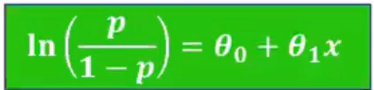

### *Loss Function
- "Cost function"
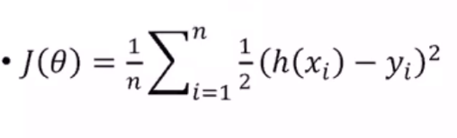
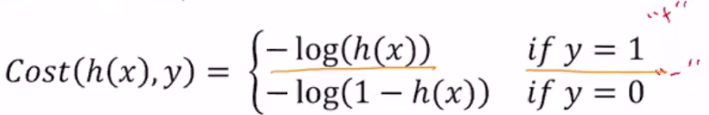
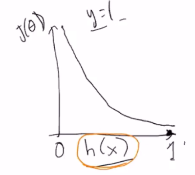
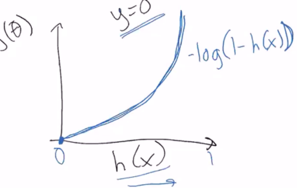
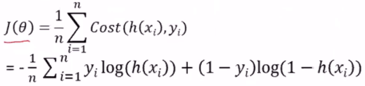

### Compare with Linear Regression
- logistic regression predicts whether something is true or false, while linear regression predicts something of continuous size
- Linear fits a straight line, while logistic fits an "S" shaped logistic curve
- Logistic curve shows likelihood of discrete classifications

---
## Multi-Layered Neural Networks

- hidden layers are <i>neuron nodes stacked in between inputs and outputs</i>, allowing neural networks to learn more complicated features (such as <i>XOR</i> logic)

### Loss functions
Squared Error: 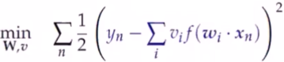

### Tanh Activation Function and Motivation
```
h_i <- tanh(w_i + x_hat)
```

### * Forward Propagation to compute output
- Compute activation of each hidden node by taking the tanh of the weighted sum of inputs (``` summation( w_i * x ```))
- Output = sum of hidden node activations * weights

#### Steps w/ Example:
1. Compute activation of each hidden node:
    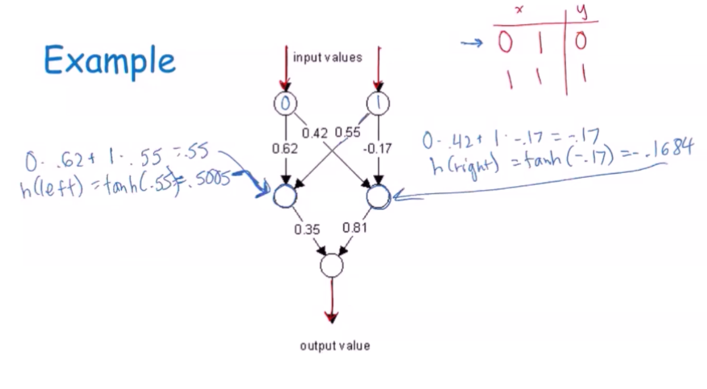
2. Compute output value:
   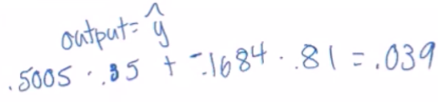
3. Find error (```expected - actual```)
    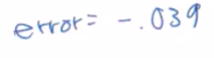
    > In this example, the expected value was 0 (see table in first step). 0 - 0.039 = -0.039

### Backward Propagation to Compute Weights
> Backpropagation is a procedure to repeatedly adjust the weights of a multilayer perceptron to minimize the difference between actual output and desired output
- ```backpropagation = gradient descent + chain rule```
- ``` e_n(error on the nth example) = y_n - summation(h_i * x_i)```

#### Steps w/ Example
1. Compute gradient change for weights from hidden to output nodes (```g = eh```) and new heights
    > There is a mistake in the below equation. should be
    ``` 
    g(left) -= 0 - 0.039*0.5005 = 0.195
    weight(left) = 0.35 - 0.0195 = 0.33
    ```
    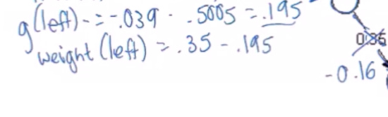
    > below equation = 0.817
    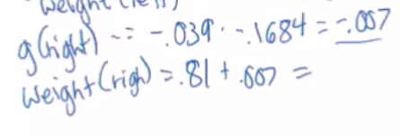
2. Compute new weights from input to hidden 
    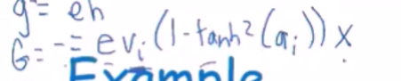
    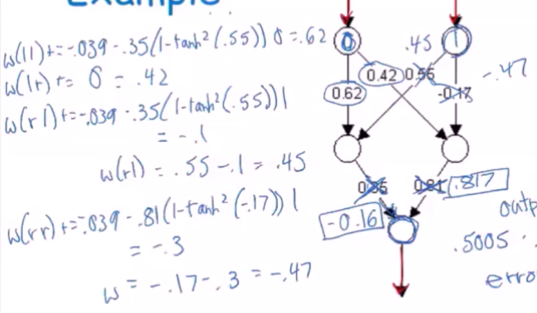


### Inductive Bias
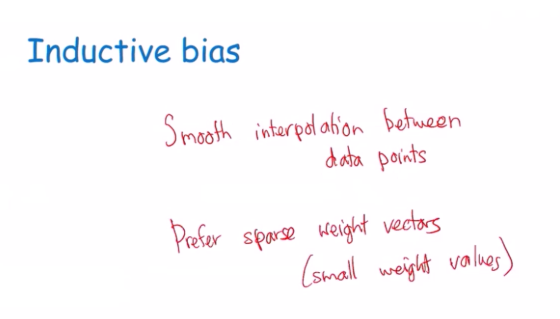
- smooth interpolation
  - any two data points with same class values, any other points between them will have same class value
- Large weight values can make the network over adjust to minor differences.
  - If some weights drom to 0, they can drop out and won't affect the function. This can be good to avoid overfitting

### * Hyperparameters and Impact on Underfitting/Overfitting
- Number of layers
- Number of hidden nodes
- Learning Rate
  - Controls how much of an adjusment you'll make each epoch (const 0<x<1)
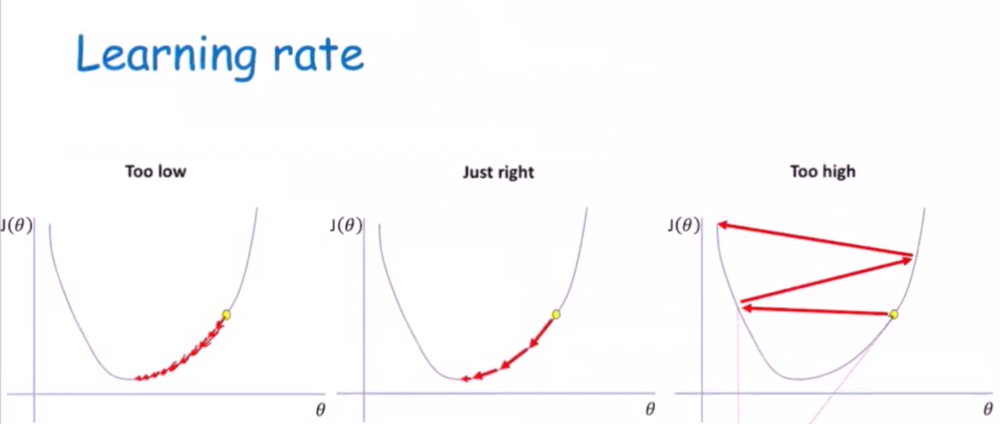
    - too high = underfit (high bias)
    - too low = overfit (high variance)
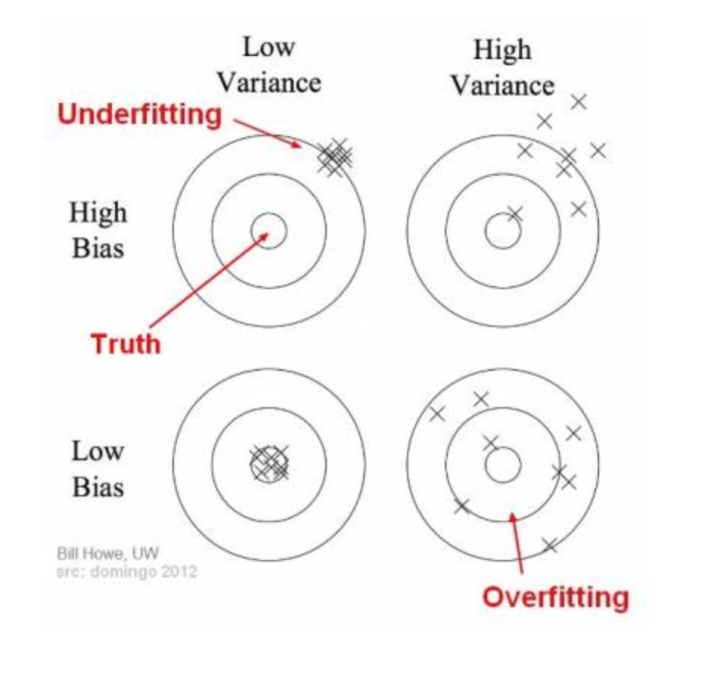
- Activation function
- Weight initialization
  - If weights can be reduced to 0, they can deop out and won't affect function. This can be helpful to avoid overfitting
- Stopping criteria (fixed number, epoch, convergence?)

---
## Deep Networks - Large Neural Networks

- Is a subset of machine learning where artificial neural networks, algorithms inspired by the human brain, learn from large amounts of data.
  - Similarly to how we learn from experience, the deep learning algorithm would perform a task repeatedly, each time tweaking it a little to improve the outcome
- 'Deep' learning because the neural networks have various layers that enable learning
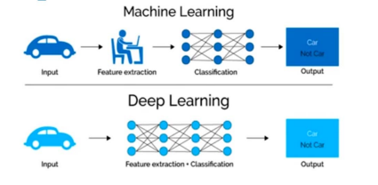
- requires a lot of data
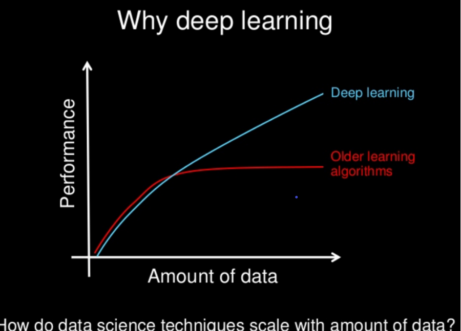

---

## Convolutional Neural Networks
- Mostly used for image classification
- a CNN has inner convolutional layers, as well as non-convolutional layers
  - the convolutional transforms input in a convolution operation
- Has a specialization to picking up patterns
  - The convolutional layers use filters to detect patterns
  - The deeper the layers, the more sophisticated these patterns are, i.e. detecting certain edges, shapes, colors, eyes, ears, scales, hair, and even full objects depending on how deep the layer is


### Convolution
- in mathematics, convolution is a mathematical operation on two functions that produce a third function expressing how the shape of one is modified by the other

### Pooling 
- pooling layers, also known as mean pooling or max pooling
  - using a grid example, one could use the mean (or max) balue of a particular feature over a reagion of the image. The new grid is a lot smaller and has much lower dimensions
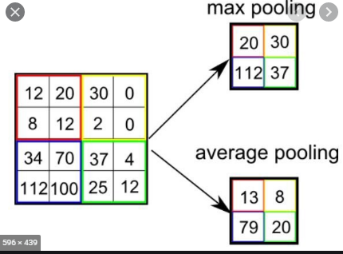

---

## Support Vector Machines (SVM)
>A supervised learning algorithm that can be used for classification and regression problems. To classify data, support vector machines make hyperplanes that best separate the data into different domains to classify it.

### Constrained Optinizations
> The problem that SVM's are dealing with. We want to optimize the hyperplane dividing the data with the largest margin possible, but we are constrained by making sure that there are no data points that are on the hyperplane, but are separated by the margin.
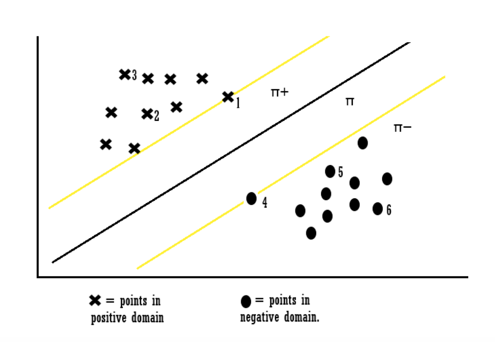

### *Hard Margin
> Cannot handle any outliers. Uses a slack parameter from each class to create the margin, but any points not within the correct area will be incorrectly classified

### *Soft Margin
> Can handle outliers. Will skip a few when creating margins and selecting slack parameters, using Zeta( ζ ) as a parameter to classify problems that are 'almost' linearly separable

### *Role of Hyperparameter in Overfitting and Underfitting
- The more outliers we ignore, the more prone we are to underfitting
- The more outliers we take into account, the closer we are to overfitting

### Slack Parameters
> The points closest to the hyperplane
- margin = distance from the vector points to the hyperplane
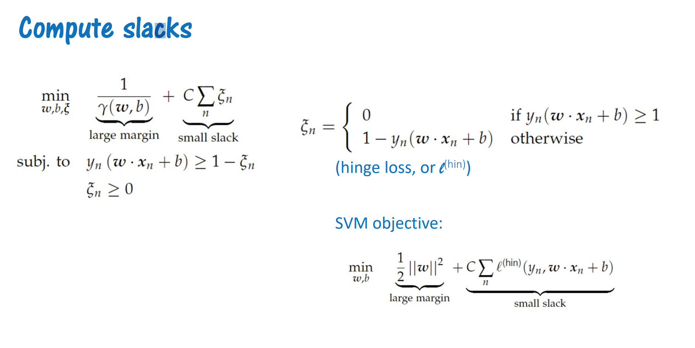

### Size of the Margin
> The larger the generally better the classification
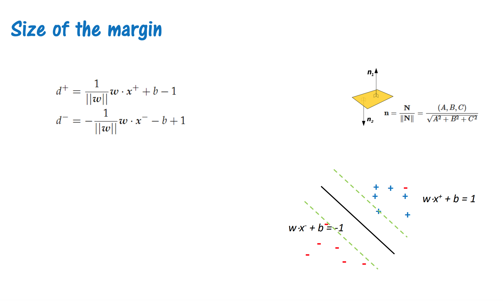
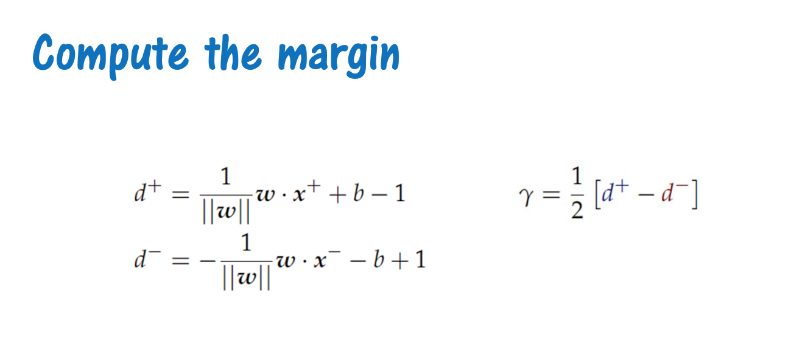

### Kernels
> The main hyperparameter for SVMs
- This is how features are mapped onto some dimensional space
- A function
- Can use linear or polynomial functions, since some will work better than others in different feature space

---

## Ensemble Classifiers

### Voting
  - Combine multiple classifiers.
  - Classifiers are each learning a function
  - Each model is trained independently then we use the models (base classifiers) to predict a class label through voting
    - On test example, everything gets a vote
    - More +1 than -1: output positive otherwise negative
  - Classifiers don't make the same over and over again. In the picture, because more models choose -1, the ensemble will choose -1
  - Why use a team of classifiers?
    - They tend to make different kinds of errors which gices higher accuracy overall. Usually the classifiers that make the wrong decisions gen outvoted.
    - Prefer classifiers with high variance, as usually the collective anser from the base classifiers will be correct.
    - N based classifiers, errors are uncorrelated, error rate is ε
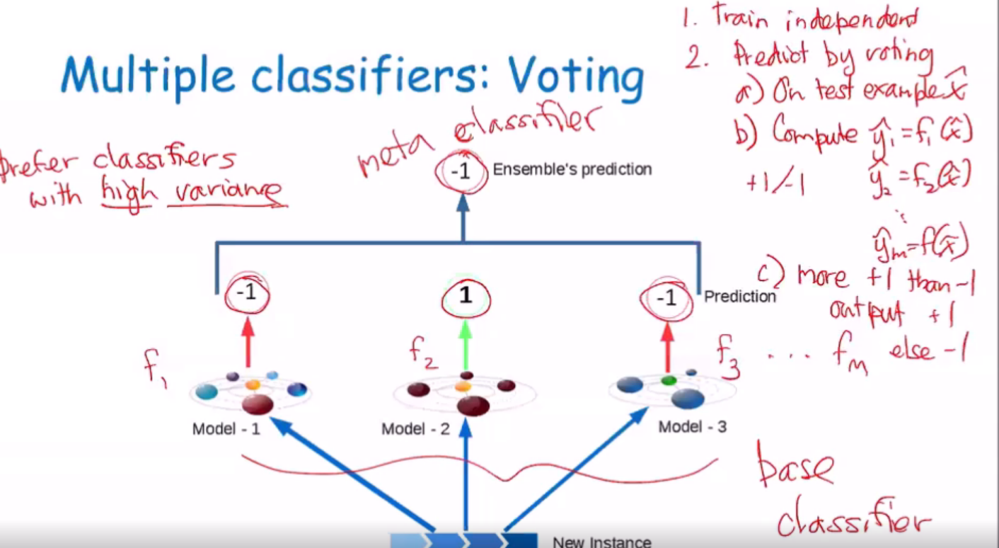

### Resampling
  - You copy a subset of data from the original data set
  - It is possible to copy the same data twice
  - The new data set is sampled from the original, so they are all valid training points
  - They will evaluate some of the same statistical properties as the original dataset
  - Way to get multiple sets of data that resemble the original distribution
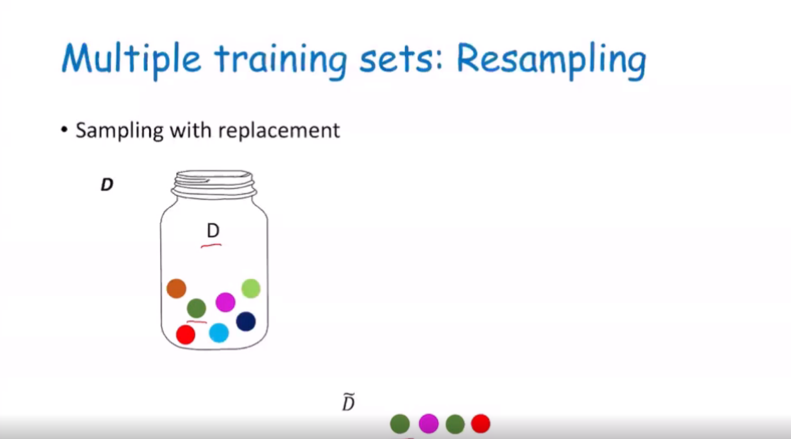

---

### Bagging - Bootstrap Appregation
- Start with training data set D with N examples
- Use sampling with replacement to create M datasets D1, .. , Dm
  - Each has size N
  - Train separate classifier
  - On each training set
  - Combine (vote)
- Used to reduce the variance for those algorithms that have high variance. Ex decision and regression trees.
- Homogenous weak learners, learns them independently from each other in parallel and combines them following some kind of deterministic averaging process


---

### Boosting
- Weak learners (slightly better than random) become strong through adaptation
- Focuses on assigning more weights to data that was previously misclassified by tha algorithm, so the weak learners become stronger
- Homogeneous weak learners, learns them sequentially in a very adaptive way (a base model depends on the previous ones) and combines them following a deterministic strategy

#### Adaboost
  - Specific implementation of boosting
  - Assigns higher weights to the difficult to classify instances
  - Works well with decision trees. It learns from previous mistakes i.e. misclassifications of data points

#### Random Forest
  - Consists of many decision trees operating in an ensample
  - Each individual tree in the random forest returns a class prediction and the class with the most votes becomes our model's prediction
  - Uses a variety of instances from a set and then runs different trees on the data
  - Final classifications is found through the voting of each of the trees

### *Ways To Establish Diversity
- we use ensemble learning to establish diversity by allowing for multiple models to be simultaneously or for data to be more precise so that we are able to use high variance individual models that produce overall results from a low variance ensemble.

## K Means++
>K-means, but we are normalizing the computed distances to the probability distribution before picking another example to calculate distances from

### Cluster Initiation
> Most important choice in running k-means is where to start the means for the clusters.
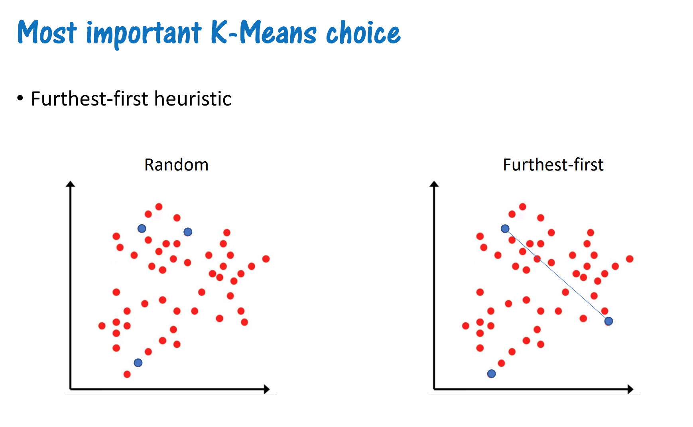


### furthest first
- instead of starting initial k-points at random points, we can start with points that are each the farthest away from each other
-  these points will probably be closer to the centers of some respective clusters. 
- This should reduce how many cycles we need to run this algorithm to find the means

### probabilistic selection of cluster means
- Distances from points to means are computed, then the distances are all normalized to a probability distribution
- The random sample can be picked from these normalized points
- Then, a new mean is chosen

---

## Dimensionality Reduction
> Process of reducing the number of random variable under consideration by creating a set of principle variables

### Principal component analysis (PCA)
- calculate new points with the averages over the given points
- then, compute covariance
- then, find the line with the best fit for data

### Principal components
    

### Minimize data distance to line
- A strategy in PCA
- to test the fit of a line to the data, we project data points onto the feature space
- we want to find the line that has the min distance between points and the line, to be the closest fit to the data

### maximize distance of projected points to origin
- A strategy in PCA
- to adjust a line to describe the data, we can try to find the line that maximizes the distances from the projected data points onto it, and the origin.

### selecting components
> by using strategies like PCA


### *Visualization of first component, additional components

---

## Overall: highlights of algorithms, *compare and contrast

### NBC

### linear regression

### logistic regression

### decision tree

### knn

### random forest

### neural network

### k means

### boosting

### svm