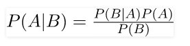
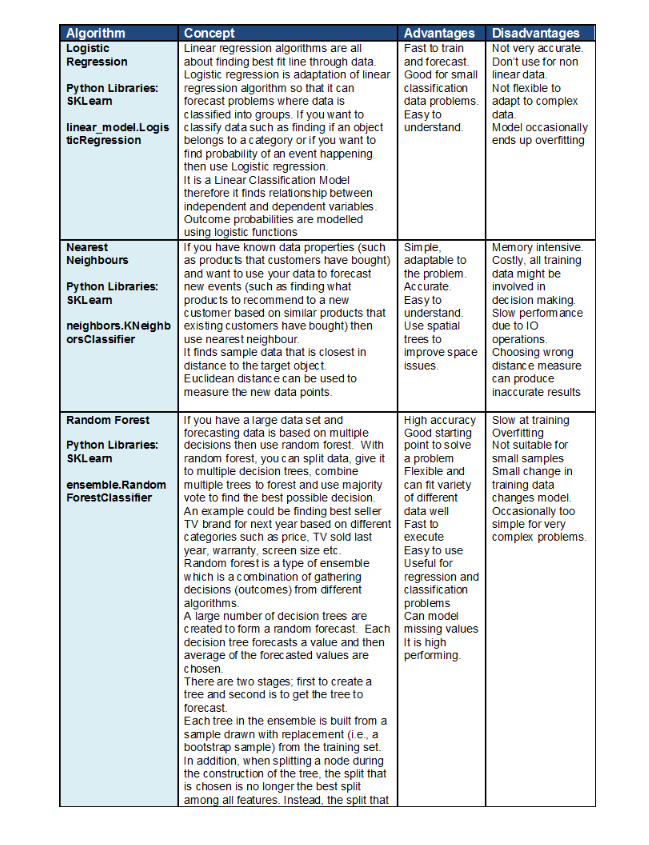

# Machine Learning Exam 3 Study Guide

- [Machine Learning Exam 3 Study Guide](#machine-learning-exam-3-study-guide)
- [Logistic Regression](#logistic-regression)
  - [Classification](#classification)
  - [*Loss Function](#loss-function)
  - [Compare with Linear Regression](#compare-with-linear-regression)
- [Multi-Layered Neural Networks](#multi-layered-neural-networks)
  - [Loss functions](#loss-functions)
  - [Tanh Activation Function and Motivation](#tanh-activation-function-and-motivation)
  - [* Forward Propagation to compute output](#ul-liforward-propagation-to-compute-outputli-ul)
    - [Steps w/ Example:](#steps-w-example)
  - [Backward Propagation to Compute Weights](#backward-propagation-to-compute-weights)
    - [Steps w/ Example](#steps-w-example-1)
  - [Inductive Bias](#inductive-bias)
  - [* Hyperparameters and Impact on Underfitting/Overfitting](#ul-lihyperparameters-and-impact-on-underfittingoverfittingli-ul)
- [Deep Networks - Large Neural Networks](#deep-networks---large-neural-networks)
- [Convolutional Neural Networks](#convolutional-neural-networks)
  - [Convolution](#convolution)
  - [Pooling](#pooling)
- [Support Vector Machines (SVM)](#support-vector-machines-svm)
  - [Constrained Optimizations](#constrained-optimizations)
  - [*Hard Margin](#hard-margin)
  - [*Soft Margin](#soft-margin)
  - [*Role of Hyperparameter in Overfitting and Underfitting](#role-of-hyperparameter-in-overfitting-and-underfitting)
  - [Slack Parameters](#slack-parameters)
  - [Size of the Margin](#size-of-the-margin)
  - [Kernels](#kernels)
- [Ensemble Classifiers](#ensemble-classifiers)
  - [Voting](#voting)
  - [Resampling](#resampling)
  - [Bagging - Bootstrap Appregation](#bagging---bootstrap-appregation)
  - [Boosting](#boosting)
    - [Adaboost](#adaboost)
    - [Random Forest](#random-forest)
  - [*Ways To Establish Diversity](#ways-to-establish-diversity)
- [K Means++](#k-means)
  - [Cluster Initiation](#cluster-initiation)
  - [furthest first heuristic](#furthest-first-heuristic)
  - [Probabilistic Selection of Cluster Means](#probabilistic-selection-of-cluster-means)
- [Dimensionality Reduction](#dimensionality-reduction)
  - [Principal component analysis (PCA)](#principal-component-analysis-pca)
  - [Principal components](#principal-components)
  - [Minimize data distance to line](#minimize-data-distance-to-line)
  - [maximize distance of projected points to origin](#maximize-distance-of-projected-points-to-origin)
  - [selecting components](#selecting-components)
  - [*Visualization of first component, additional components](#visualization-of-first-component-additional-components)
- [Overall: highlights of algorithms, *compare and contrast](#overall-highlights-of-algorithms-compare-and-contrast)
  - [Naive Bayes Classifier (NBC)](#naive-bayes-classifier-nbc)
    - [Strengths:](#strengths)
    - [Weakness:](#weakness)
    - [shit from amariah's last study guide:](#shit-from-amariahs-last-study-guide)
    - [Gaussian naïve Bayes, Laplace smoothing, NBC for text mining](#gaussian-na%c3%afve-bayes-laplace-smoothing-nbc-for-text-mining)
  - [linear regression](#linear-regression)
    - [Strengths](#strengths-1)
    - [Weaknesses](#weaknesses)
  - [logistic regression](#logistic-regression-1)
    - [Strengths](#strengths-2)
    - [Weaknesses](#weaknesses-1)
  - [decision tree](#decision-tree)
    - [Strengths](#strengths-3)
    - [Weaknesses](#weaknesses-2)
  - [knn](#knn)
    - [Strengths](#strengths-4)
    - [Weaknesses](#weaknesses-3)
  - [random forest](#random-forest-1)
    - [Strengths](#strengths-5)
    - [Weaknesses](#weaknesses-4)
  - [neural network](#neural-network)
    - [Strengths](#strengths-6)
    - [Weaknesses](#weaknesses-5)
  - [k means](#k-means-1)
    - [Strengths](#strengths-7)
    - [Weaknesses](#weaknesses-6)
  - [boosting](#boosting-1)
    - [Strengths](#strengths-8)
    - [Weaknesses](#weaknesses-7)
  - [svm](#svm)
    - [Strengths](#strengths-9)
    - [Weakness](#weakness-1)
- [Supervised Learning](#supervised-learning)
- [Unsupervised Learning](#unsupervised-learning)
- [Extras](#extras)
  - [pros and cons of each classifier/regressor (from amariah's last study guide)](#pros-and-cons-of-each-classifierregressor-from-amariahs-last-study-guide)
  - [k-folds cross validation](#k-folds-cross-validation)

# Logistic Regression

## Classification
- Discrete and supervised
- Good for when dependent variable is binary (yes/no, red/blue, etc)
- Determines probability of the binary classification (y val of sigma curve)
  

## *Loss Function
- "Cost function"


## Compare with Linear Regression
- logistic regression predicts whether something is true or false, while linear regression predicts something of continuous size
- Linear fits a straight line, while logistic fits an "S" shaped logistic curve
- Logistic curve shows likelihood of discrete classifications


# Multi-Layered Neural Networks

- hidden layers are <i>neuron nodes stacked in between inputs and outputs</i>, allowing neural networks to learn more complicated features (such as <i>XOR</i> logic)

## Loss functions
Squared Error: 

## Tanh Activation Function and Motivation
```
h_i <- tanh(w_i + x_hat)
```

## * Forward Propagation to compute output
- Compute activation of each hidden node by taking the tanh of the weighted sum of inputs (``` summation( w_i * x ```))
- Output = sum of hidden node activations * weights

### Steps w/ Example:
1. Compute activation of each hidden node:
    
2. Compute output value:
   
3. Find error (```expected - actual```)
    
    > In this example, the expected value was 0 (see table in first step). 0 - 0.039 = -0.039

## Backward Propagation to Compute Weights
> Backpropagation is a procedure to repeatedly adjust the weights of a multilayer perceptron to minimize the difference between actual output and desired output
- ```backpropagation = gradient descent + chain rule```
- ``` e_n(error on the nth example) = y_n - summation(h_i * x_i)```

### Steps w/ Example
1. Compute gradient change for weights from hidden to output nodes (```g = eh```) and new heights
    > There is a mistake in the below equation. should be
    ``` 
    g(left) -= 0 - 0.039*0.5005 = 0.195
    weight(left) = 0.35 - 0.0195 = 0.33
    ```
    
    > below equation = 0.817
    
2. Compute new weights from input to hidden 
    
    


## Inductive Bias

- smooth interpolation
  - any two data points with same class values, any other points between them will have same class value
- Large weight values can make the network over adjust to minor differences.
  - If some weights drom to 0, they can drop out and won't affect the function. This can be good to avoid overfitting

## * Hyperparameters and Impact on Underfitting/Overfitting
- Number of layers
- Number of hidden nodes
- Learning Rate
  - Controls how much of an adjusment you'll make each epoch (const 0<x<1)
  


    - too high = underfit (high bias)
    - too low = overfit (high variance)
  


- Activation function
- Weight initialization
  - If weights can be reduced to 0, they can deop out and won't affect function. This can be helpful to avoid overfitting
- Stopping criteria (fixed number, epoch, convergence?)


# Deep Networks - Large Neural Networks

- Is a subset of machine learning where artificial neural networks, algorithms inspired by the human brain, learn from large amounts of data.
  - Similarly to how we learn from experience, the deep learning algorithm would perform a task repeatedly, each time tweaking it a little to improve the outcome
- 'Deep' learning because the neural networks have various layers that enable learning
  


- requires a lot of data
  


# Convolutional Neural Networks
- Mostly used for image classification
- a CNN has inner convolutional layers, as well as non-convolutional layers
  - the convolutional transforms input in a convolution operation
- Has a specialization to picking up patterns
  - The convolutional layers use filters to detect patterns
  - The deeper the layers, the more sophisticated these patterns are, i.e. detecting certain edges, shapes, colors, eyes, ears, scales, hair, and even full objects depending on how deep the layer is


## Convolution
- in mathematics, convolution is a mathematical operation on two functions that produce a third function expressing how the shape of one is modified by the other

## Pooling 
- pooling layers, also known as mean pooling or max pooling
  - using a grid example, one could use the mean (or max) balue of a particular feature over a reagion of the image. The new grid is a lot smaller and has much lower dimensions


# Support Vector Machines (SVM)
>A supervised learning algorithm that can be used for classification and regression problems. To classify data, support vector machines make hyperplanes that best separate the data into different domains to classify it.

## Constrained Optimizations
> The problem that SVM's are dealing with. We want to optimize the hyperplane dividing the data with the largest margin possible, but we are constrained by making sure that there are no data points that are on the hyperplane, but are separated by the margin.


## *Hard Margin
> Cannot handle any outliers. Uses a slack parameter from each class to create the margin, but any points not within the correct area will be incorrectly classified

## *Soft Margin
> Can handle outliers. Will skip a few when creating margins and selecting slack parameters, using Zeta( ζ ) as a parameter to classify problems that are 'almost' linearly separable

## *Role of Hyperparameter in Overfitting and Underfitting
- The more outliers we ignore, the more prone we are to underfitting
- The more outliers we take into account, the closer we are to overfitting

## Slack Parameters
> The points closest to the hyperplane
- margin = distance from the vector points to the hyperplane


## Size of the Margin
> The larger the generally better the classification


## Kernels
> The main hyperparameter for SVMs
- This is how features are mapped onto some dimensional space
- A function
- Can use linear or polynomial functions, since some will work better than others in different feature space


# Ensemble Classifiers

## Voting
  - Combine multiple classifiers.
  - Classifiers are each learning a function
  - Each model is trained independently then we use the models (base classifiers) to predict a class label through voting
    - On test example, everything gets a vote
    - More +1 than -1: output positive otherwise negative
  - Classifiers don't make the same over and over again. In the picture, because more models choose -1, the ensemble will choose -1
  - Why use a team of classifiers?
    - They tend to make different kinds of errors which gices higher accuracy overall. Usually the classifiers that make the wrong decisions gen outvoted.
    - Prefer classifiers with high variance, as usually the collective anser from the base classifiers will be correct.
    - N based classifiers, errors are uncorrelated, error rate is ε


## Resampling
  - You copy a subset of data from the original data set
  - It is possible to copy the same data twice
  - The new data set is sampled from the original, so they are all valid training points
  - They will evaluate some of the same statistical properties as the original dataset
  - Way to get multiple sets of data that resemble the original distribution


## Bagging - Bootstrap Appregation
- Start with training data set D with N examples
- Use sampling with replacement to create M datasets D1, .. , Dm
  - Each has size N
  - Train separate classifier
  - On each training set
  - Combine (vote)
- Used to reduce the variance for those algorithms that have high variance. Ex decision and regression trees.
- Homogenous weak learners, learns them independently from each other in parallel and combines them following some kind of deterministic averaging process


## Boosting
- Weak learners (slightly better than random) become strong through adaptation
- Focuses on assigning more weights to data that was previously misclassified by tha algorithm, so the weak learners become stronger
- Homogeneous weak learners, learns them sequentially in a very adaptive way (a base model depends on the previous ones) and combines them following a deterministic strategy

### Adaboost
  - Specific implementation of boosting
  - Assigns higher weights to the difficult to classify instances
  - Works well with decision trees. It learns from previous mistakes i.e. misclassifications of data points

### Random Forest
  - Consists of many decision trees operating in an ensample
  - Each individual tree in the random forest returns a class prediction and the class with the most votes becomes our model's prediction
  - Uses a variety of instances from a set and then runs different trees on the data
  - Final classifications is found through the voting of each of the trees

## *Ways To Establish Diversity
- we use ensemble learning to establish diversity by allowing for multiple models to be simultaneously or for data to be more precise so that we are able to use high variance individual models that produce overall results from a low variance ensemble.

# K Means++
>K-means, but we are normalizing the computed distances to the probability distribution before picking another example to calculate distances from
- kmeans guarantied to converge, but not to find optimal solution

Goal: 

Alg: 
>k-means++ is never more than O(log k) away from optimal, and it is sometimes nearly O(1)

- When we pick the kth mean, instead of choosing the absolute farthest away point, we choose a point where the probability thats proportional to the squared distance
  -   A weighted random choice


## Cluster Initiation
> Most important choice in running k-means is where to start the means for the clusters.


## furthest first heuristic
- refined how kmeans initializes clusters centers
  - tries to spread centers apart


- instead of starting initial k-points at random points, we can start with points that are each the farthest away from each other
-  these points will probably be closer to the centers of some respective clusters. 
- This should reduce how many cycles we need to run this algorithm to find the means

> Steps to find initial centers with furthest first heuristic:
> 1. Choose random point for first point
> 2. Choose point that is the furthest away from first point
> 3. Choose point that is furthest away from first two points
> 4. Continue k times until all points are plotted

## Probabilistic Selection of Cluster Means
- Distances from points to means are computed, then the distances are all normalized to a probability distribution
- The random sample can be picked from these normalized points
- Then, a new mean is chosen


# Dimensionality Reduction
> Process of reducing the number of random variable under consideration by creating a set of principle variables
- most of the methods we have learned rely on supervised learning, but we want an unsupervised learning


## Principal component analysis (PCA)
- calculate new points with the averages over the given points
- then, compute covariance
- then, find the line with the best fit for data
> Goal: reduce dataset with high dimensionality (>10k) to a dataset with low dimensionality (<100) while retaining data characteristics
> Motivation: Data compression (ex. reduce data from 2D to 1D)
>   This halves data requirement, speeds up the alg, and most times improves performance bc reduced dimensional spaces

- tries to minimize projection error
  - maximum variance and minimum error are reached at the same time
- Is a linear combination of variables


## Principal components
- Line with max variance and minimum error is 1st principal component
- as you minimize projection error you maximize the variance
- eigenvector
  - for PC1 is the first unit vector
- Loading scores
  - are proportions of the original features in the vector
- Eigenvalue
  - is square sum of the best line
- singular value
  - square root of eigenvalue
- Principal component 2 is simply the line through the origin that is perpendicular to PC1 without any further optimizations that has been done
- Any new PC must be perpendicular to all the previous components

## Minimize data distance to line
- A strategy in PCA
- to test the fit of a line to the data, we project data points onto the feature space
- we want to find the line that has the min distance between points and the line, to be the closest fit to the data

## maximize distance of projected points to origin
- A strategy in PCA
- to adjust a line to describe the data, we can try to find the line that maximizes the distances from the projected data points onto it, and the origin.

## selecting components
> by using strategies like PCA
- how many?
  - Choose new k to be the smallest value such that some threshold amount (like (90%) of variance is retained within those components)
  - or - elbow method - if you plot num components against variance than when you see the variance decreasing (into an elbow) you can stop there
  


## *Visualization of first component, additional components
- the first PC is going to have a majority of the variance and then each additional component will lower the variance


# Overall: highlights of algorithms, *compare and contrast

## Naive Bayes Classifier (NBC)
- discrete
- can be much faster than other classification algorithms
- supervised learning classification algorithm
- best in text classification
- must faster than KNN
- can be used for prediction in real time

### Strengths:
  - performs well in practiice, easy to implement and scale with your dataset
  
### Weakness:
  - Due to their simplicity, they are beaten by models properly trained and tuned using other algorithms

### shit from amariah's last study guide:


don't need to calculate if we already have the data (think about play tennis example. we can see (play | overcast) in table)
- if any two events are independent, then
```
P(A,B) = P(A)*P(B)
```


- P(y) = class probability
- P(x_i|y) = conditional probability
  


###        Gaussian naïve Bayes, Laplace smoothing, NBC for text mining
- continuous vals associated w/ each feature are assumed to be distributed according to Gaussian (Normal) Dist

---

## linear regression

  ### Strengths
  - Straightforward and easy to explain
  - can be regularized to avoid overfitting
  - updated easily with new data

### Weaknesses
  - performs poorly when there is a non-linear relationship
  - not naturally flexible enough to capture more complex patterns

---

## logistic regression

### Strengths
- Convenient probability score for observations
- lots of industry solutions
  
### Weaknesses
- doesn't perform well when feature space is too large
- doesn't handle large numbers of features or variables well
- relies on transformation for non-linear features

---

## decision tree

### Strengths
- intuitive decision rules
- can handle nonlinear features
- takes into account variable interactions
  
### Weaknesses
- high biased to training set
- no ranking score as direct result

---

## knn
- supervised lazy classifier
- difficult to use this for prediction in real time
- decision boundaries are more complex than decision trees
- finds similarities between observations due to its inherent nature to optimize locally

### Strengths
  - Intuitive and simple, no assumptions, or training set
  - Constantly evolves and very easy for multi-class problems
  - classifier and regression with one hyper parameter

### Weaknesses
  - very slow with the curse of dimensionality
  - needs homogeneous features with optimal amounts of neighbors
  - imbalanced data can cause a lot of problems; outlier sensitivity and no capability for missing value treatment
  - outliers can significantly kill the performance

---

## random forest

### Strengths
- can compete with the best supervised learning algorithms
- provides a reliable feature importance estimate
- offers efficient estimates of teh test error without incurring the cost of repeated model training associated with cross-validation

### Weaknesses
- An ensemble model is inherently less interpretable than an individual decision tree
- Training a large number of deep trees can have high computational costs (but can be parallelized) and use a lot of memory
- predictions are slower, which may create challenges


---

## neural network

### Strengths
- easy to conceptualize
- settings of a neural network can be adapted to varying circumstances and demands
- efficient at recognizing patterns in images

### Weaknesses
- there are alternatives that are simpler, faster, easier to train, adn provide better performance
  - svm
  - decision tree
  - regression
- multi-layer neural networks are usually hard to train, and require tuning lots of parameters
- outcome can contain uncertainty
- quality of outcome is directly related to quality of data
- the user has little influence on the function of the network (weighting and thresholds)

---

## k means

### Strengths
- most popular clustering algorithm because it is fast, simple, and surprisingly flexible if you pre-process your data nda engineer useful features

### Weaknesses
- must specify the number of clusters, which isn't always easy to do

---

## boosting

### Strengths
- prediction interpretations easy to handle
- the prediction capability is efficient through the use of its clone methods, such  as bagging, random forest, and decision trees
- resilient method that curbs over-fitting

### Weaknesses
- Sensitive to outliers since every classifier is obliges to fix the errors of the predecessors, therefore it is too dependent on outliers
- very difficult to scale up, as every estimator bases its correctness on the previous predictors, thus making the procedure difficult to streamline

---

## svm

### Strengths
- can model non-linear decision boundaries
- robust against overfitting, especially in high-dimensional space
- does not rely on entire data

### Weakness
- memory intensive
- trickier to tune due to the importance of picking the right kernel
- doesn't scale well to larger datasets

---

# Supervised Learning




# Unsupervised Learning


# Extras

## pros and cons of each classifier/regressor (from amariah's last study guide)

|                           | pros                                                                                                                                                                                                                                                                                                                              | cons                                                                                                                                                                                                                            |
| ------------------------- | --------------------------------------------------------------------------------------------------------------------------------------------------------------------------------------------------------------------------------------------------------------------------------------------------------------------------------- | ------------------------------------------------------------------------------------------------------------------------------------------------------------------------------------------------------------------------------- |
| logistic regression       | outputs have nice probabilistic interpretation and the algorithm can be regularized to avoid overfitting. logistic models can be updated easily with new data using stochastic gradient descent                                                                                                                                   | tends to underperform when there are multiple or non-linear decision boundaries. they are not flexible enough to naturally capture more complex relationships                                                                   |
| regression/decision trees | can learn non-linear relationships, and are fairly robust to outliers. ensembles perform v well in practice, winning many classical machine learning competitions                                                                                                                                                                 | unconstrained, individual trees are prone to overfitting because they can keep branching until they memorize the training data. however, this can be alleviated by using ensembles.                                             |
| KNN                       |                                                                                                                                                                                                                                                                                                                                   | memory intensive, perform poorly for high-dimensional data, and require meaningful distance function to calc simularity. in practice, training regularized regression or tree ensembles are almost always   better uses of time |
| logistic regression       | same as above low variance provides probabilities for outcomes works well with diagonal (feature) decision boundaries                                                                                                                                                                                                             | same as above. not flexible enough for complex relationships high bias                                                                                                                                                          |
| decision trees            | perform v well in practice. robust to outliers, scalable, and able to naturally model non-linear decision boundaries thanks  to their hierarchical structure easy to interpret visually when tree only has a few lvls easily handle qualitative (categorical) features works well w/ decision boundaries parallel to feature axis | unconstrained, indv trees prone to overfitting.  trim the goddamn treeissues w/ diagonal decision boundaries                                                                                                                    |
| bagged trees              | reduce variance in comp to reg DTs provide variable importance measures good with qualitative features out of bag estimates can be used for model validation                                                                                                                                                                      | not easy to visually interpret does not reduce variance if features are correlated                                                                                                                                              |
| boosted trees             | somewhat more interpretable than bagged trees/random forests as the user can  define the size of each tree resulting in a collection of stumps (1 lvl)   which can be viewed as an additive model can easily handle qualitative features                                                                                          | can overfit if num of trees is too large                                                                                                                                                                                        |
| random forest             | decorrelates trees (important when dealing with muliple features which  may be correlated) reduces variance                                                                                                                                                                                                                       | not easy to visually interpret                                                                                                                                                                                                  |
| svm                       | similar to LR when linear separation good with non-linear boundary depending on kernel used handle high dimensional data well                                                                                                                                                                                                     | susceptible to overfitting/trainign issues depending on kernel                                                                                                                                                                  |
| naive bayes               | even though conditional independence assumption rarely holds true, NB models   perform surprisingly well in practice, esp for how simple they are. easy to implement, can scale with dataset                                                                                                                                      | bc of simplicity, they are often beaten by models properly trained and tuned using prev algs listed                                                                                                                             |
| k-means                   | most popular clustering alg bc fast, simple, and flexible if you pre-process your data and engineer useful features                                                                                                                                                                                                               | user must specify num of clusters, which isn't easy to do.  if true underlying clusters in data are no globular, then k-means will produce poor clusters                                                                        |


## k-folds cross validation


